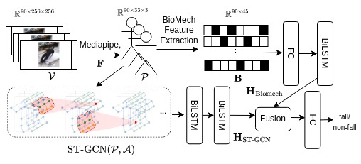
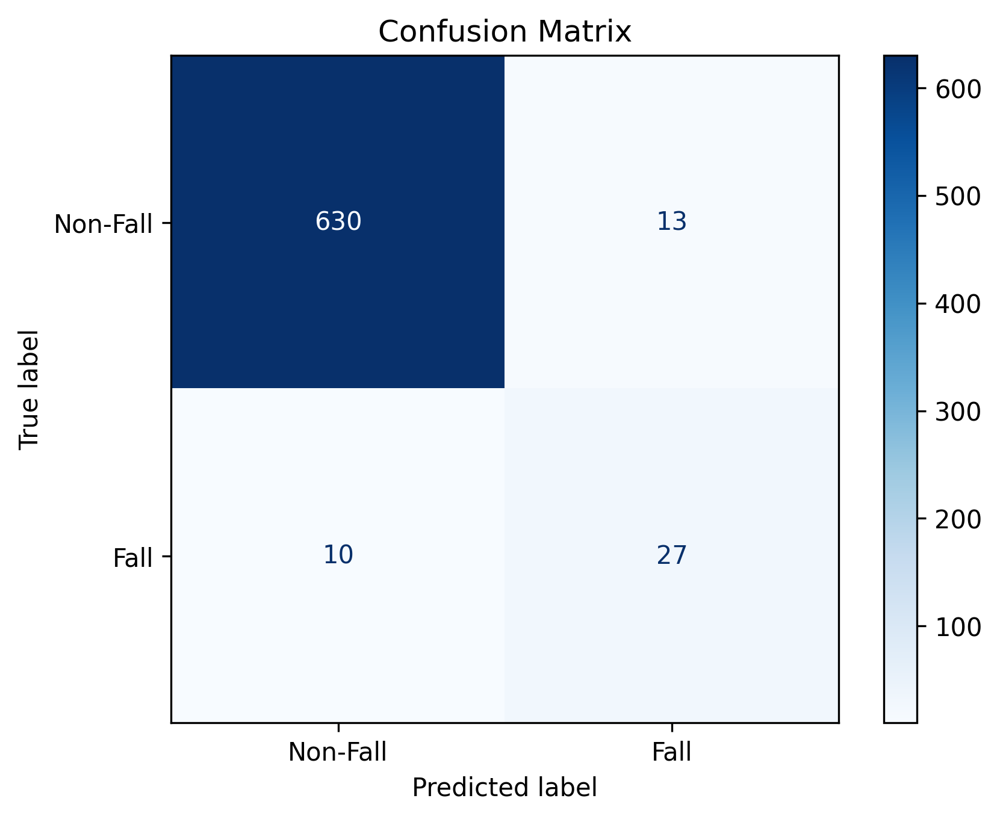
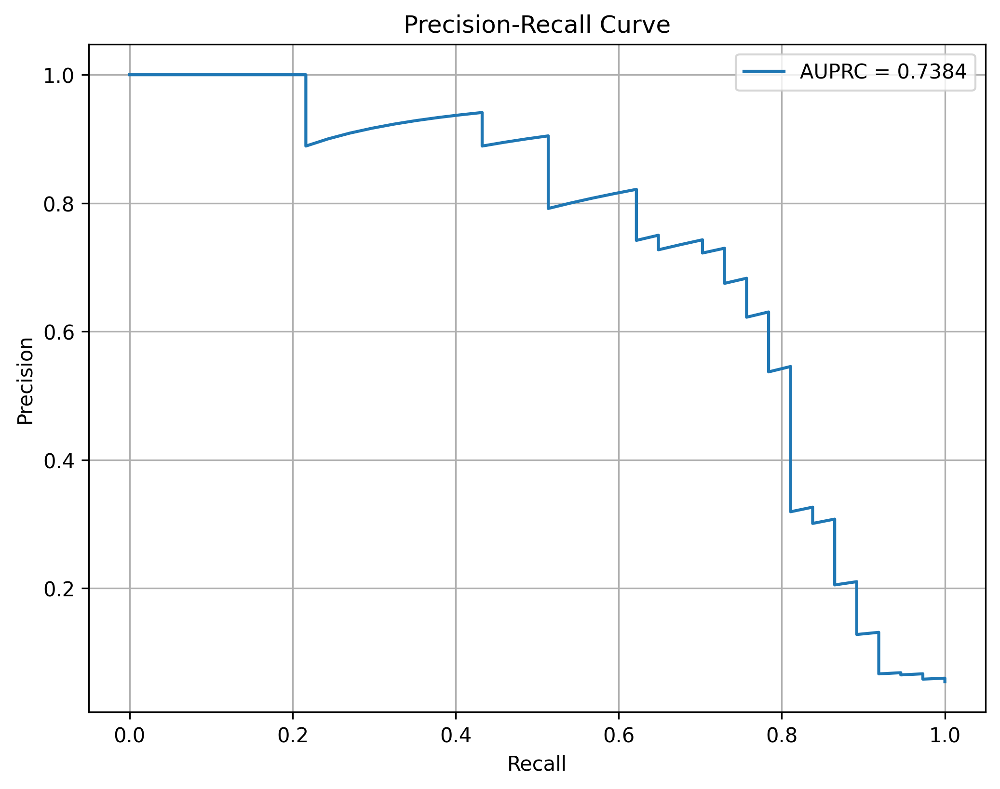
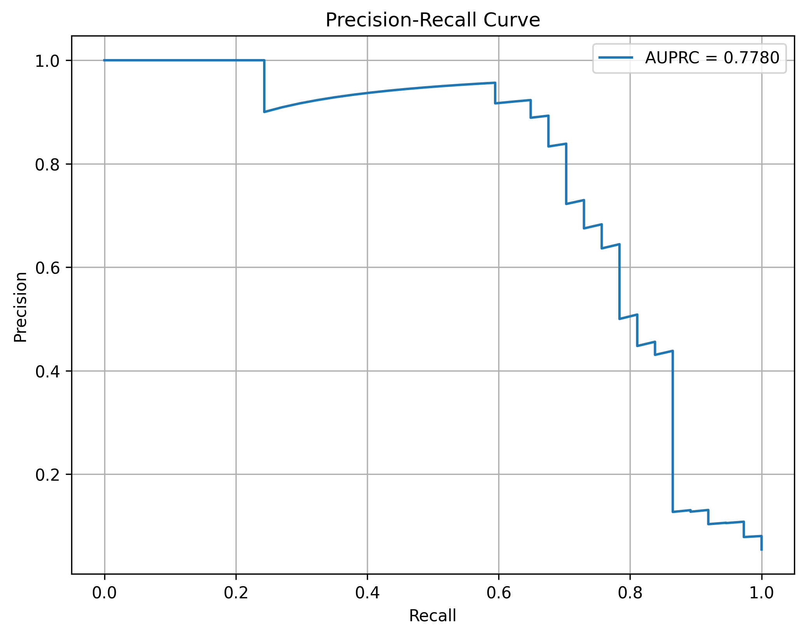

# FallGCN: Fall Intent Prediction Using Fusion of Spatial-Temporal Graph Convolutional Networks and Biomechanical Feature

A repository for predicting falls using skeletal (pose) and biomechanics data. The pipeline supports two model variants:
- **Vanilla Model**: Uses only skeleton (pose) data process by GCN
- **Fusion Model**: Combines skeleton data with biomechanics data for enhanced prediction accuracy

## Table of Contents
- [Features](#features)
- [Installation](#installation)
- [Dataset](#dataset)
- [Model Training](#model-training)
- [Inference](#inference)
- [Evaluation](#evaluation)

## Features

- Dual model support (vanilla and fusion)
- use graph based model (ST-GCN+LSTM) for prediction
- Hugging Face integration for model management
- Flexible inference pipeline
- Evaluation metrics (e.g., f1 score, AUPRC)

## Installation


### Prerequisites

- Python 3.8 or higher
- CUDA-capable GPU
- CUDA Toolkit 12.1
- PyTorch 2.1.0 with CUDA 12.1 support (check their website)
  ```bash
  # Install PyTorch with CUDA 12.1
  pip3 install torch torchvision torchaudio --index-url https://download.pytorch.org/whl/cu121
  ```
- Hugging Face account (for accessing model repositories)


### Setup

1. **Clone the Repository**
   ```bash
   git clone https://github.com/fokhruli/fallGCN.git
   cd fallGCN
   ```

2. **Create Virtual Environment**
   ```bash
   python3 -m venv venv
   
   # Unix/MacOS
   source venv/bin/activate
   
   # Windows
   venv\Scripts\activate
   ```

3. **Install Dependencies**
   ```bash
   pip install --upgrade pip
   pip install -r requirements.txt
   ```

## Dataset
* [Multiple cameras fall dataset](https://www.iro.umontreal.ca/~labimage/Dataset/)
* [Technical report](https://www.iro.umontreal.ca/~labimage/Dataset/technicalReport.pdf)
### Data Download and Setup

1. Download the dataset:
   ```bash
   wget https://www.iro.umontreal.ca/~labimage/Dataset/dataset.zip -O dataset.zip
   ```

3. Extract and organize:
   ```bash
   unzip dataset.zip
   ```

### Data Format
- **Video Files**: `.avi` format, 8 synchronized camera views per scenario
- **Total Size**: Approximately 3 GB (uncompressed)


### Data Structure
The dataset consists of 24 fall scenarios (`chute01` to `chute24`), each containing:
- 8 camera views (cam1.avi to cam8.avi)
- Associated landmark files in the `landmarks` directory (need to create)

```
dataset/
├── chute01/
│   ├── cam1.avi
│   ├── cam2.avi
│   ...
│   ├── cam8.avi
│   └── landmarks/
│       ├── cam1_landmarks.txt
│       ├── cam2_landmarks.txt
│       ...
│       └── cam8_landmarks.txt
├── chute02/
...
└── chute24/
```

## Preprocessing

The preprocessing pipeline consists of four main stages:

### 1. Landmark Extraction
```bash
# Run the landmark extraction script
python data_preprocess_scripts/data_preprocess_from_videos.py
```

This step:
- Processes raw video files from all cameras
- Extracts 3D pose landmarks using MediaPipe
- Saves landmarks in .txt format for each camera view

### Directory Structure After Preprocessing

```
dataset/
├── chute01/
│   ├── cam1.avi
│   ├── cam2.avi
│   ├── cam3.avi
│   ├── cam4.avi
│   ├── cam5.avi
│   ├── cam6.avi
│   ├── cam7.avi
│   ├── cam8.avi
│   └── landmarks/
│       ├── cam1_landmarks.txt
│       ├── cam2_landmarks.txt
│       ├── cam3_landmarks.txt
│       ├── cam4_landmarks.txt
│       ├── cam5_landmarks.txt
│       ├── cam6_landmarks.txt
│       ├── cam7_landmarks.txt
│       └── cam8_landmarks.txt
├── chute02/
    [same structure as above]
...
└── chute24/
    [same structure as above]

```

### 2. Label Generation
```bash
# Generate labels using the dataset mapping
python data_preprocess_scripts/create_label_file.py
# output csv file: fall_detection_labels_combines.csv
```

This step:
- Uses provided frame-level annotations
- Accounts for camera synchronization lag
- Handles multi-camera temporal alignment

### 3. Graph Dataset Creation
```bash
# Create graph-based dataset
python data_preprocess_scripts/make_training_pose_data.py
```

For visulization and check validity of data creation:
```bash
# Create graph-based dataset
python data_preprocess_scripts/analyzing_skeleton.py
```

### 4. Handcrafted Feature Extraction for 45 biomechanical features 
```bash
# Extract handcrafted biomechanical features
python data_preprocess_scripts/calculate_biomechanical_features.py
```
This step:
- Calculates biomechanical features
- For more information about features see given report

### Data Validation
After preprocessing, validate the data:
```bash
python data_preprocess_scripts/check_input_csv_dimention.py
```

## Model Training

### Model Architecture
The system uses STGCN_LSTM architecture with two variants:
- Vanilla model for pose-only prediction
- Fusion model for combined pose and biomechanics prediction

### Model Pipeline
<div align="center">
    
    <br>
    <a href="images/Overall_diagram.drawio.pdf">View PDF version</a>
</div>

**Figure 1: Fall Prediction Model Pipeline.** The workflow consists of several key stages:
1. **Input Processing**: Video frames are processed using MediaPipe Pose to extract 3D landmarks
2. **Data Preparation**: Landmarks are labeled and segmented using a sliding window approach
3. **Dual-Stream Processing**:
   - **Pose Stream**: Processes pose data through ST-GCN and BiLSTM
   - **Biomechanical Stream**: Analyzes biomechanical features using neural network and BiLSTM
4. **Feature Fusion**: Concatenates feature vectors from both streams
5. **Classification**: Processed through fully connected layers to generate fall probability
6. **Training**: Uses weighted Binary Cross-Entropy loss to handle class imbalance


<!-- 1. **Configure Training Parameters**

For now, I hardcorded all parameters in the model and trainer.py file.

here, there is two model given,
one is normal stgcn with 2 lstm layer and for loss we used weighted loss
others,
use fusion mechanisam to combine both stgcn and biomechanical features, the fusion is based on attention fusion so, model can rely on important role of biomechanical fearures from stgcn query (it actually worked better while training then concatenining or other fusion mechnicsam)

script is simple 
normal stgcn: python STGCN_LSTM/trainer.py

with biomechanical fearture fusion: python STGCN_LSTM_Biomechanics/trainer.py

there is also other files
STGCN_LSTM/graph.py: for graph information in gcn
STGCN_LSTM/data_processing.py : crate dataset for model requirements
STGCN_LSTM/stgcn.py:  whole model build here, details will given in report -->

### Training Process

#### Fall Detection Models
```
├── STGCN_LSTM/
│   ├── trainer.py          # Training script for basic model
│   ├── graph.py           # Graph structure definitions
│   └── data_processing.py # Dataset preparation utilities
│
├── STGCN_LSTM_Biomechanics/
│   ├── trainer.py          # Training script for fusion model
│   ├── graph.py           # Graph structure definitions
│   └── data_processing.py # Dataset preparation utilities
```

#### Model Variants

1. Basic ST-GCN with LSTM (`STGCN_LSTM/`)
- Basic implementation of Spatial-Temporal GCN with LSTM
- Processes skeleton data only
- Contains:
  - `trainer.py`: Main training script
  - `graph.py`: Graph structure and adjacency matrix definitions
  - `data_processing.py`: Data preparation utilities

2. ST-GCN with Biomechanical Features (`STGCN_LSTM_Biomechanics/`)
- Enhanced model with biomechanical feature fusion
- Attention-based fusion mechanism
- Contains:
  - `trainer.py`: Training script with fusion implementation
  - `graph.py`: Graph definitions 
  - `data_processing.py`: Extended data processing for biomechanical features

## Training Process

For basic ST-GCN model:
```bash
python STGCN_LSTM/trainer.py
```

For biomechanical fusion model:
```bash
python STGCN_LSTM_Biomechanics/trainer.py
```


## Inference

### Running Inference
1. **Using Vanilla Model**
   ```bash
   python inference_script.py --model vanilla --use_cuda
   ```

2. **Using Fusion Model**
   ```bash
   python inference_script.py --model fusion --use_cuda
   ```

### Model Selection
- Vanilla Model: `best_model_vanilla.pth`
- Fusion Model: `best_model_with_fusion.pth`

Both models are available on Hugging Face Hub: `fokhrul006/fall_prediction`

## Evaluation

### Metrics
The pipeline automatically calculates:
- Precision, Recall, F1-Score
- Area Under Precision-Recall Curve (AUPRC)


### Visualization

* AUPRC

<p align="center">
  
  
</p>
<p align="center">
  <em>Left: Vanilla ST-GCN &nbsp;&nbsp;&nbsp;&nbsp; Right: ST-GCN with Biomechanical Feature Fusion</em>
</p>

* Confusion Matrices

<p align="center">
  
  
</p>
<p align="center">
  <em>Left: Vanilla ST-GCN &nbsp;&nbsp;&nbsp;&nbsp; Right: ST-GCN with Biomechanical Feature Fusion</em>
</p>

<!-- 
### Logging
- Logs are stored in `logs/inference.log`
- Each run overwrites previous logs
- Includes model performance metrics and execution details

## Contributing

1. Fork the repository
2. Create your feature branch
   ```bash
   git checkout -b feature/YourFeatureName
   ```
3. Commit your changes
   ```bash
   git commit -m "Add feature: YourFeatureName"
   ```
4. Push to your fork
   ```bash
   git push origin feature/YourFeatureName
   ```
5. Create a Pull Request -->

<!-- ## License

This project is licensed under the MIT License. -->

## Contact

- Name: Md Fokhrul Islam
- Email: fokhrul.rmedu@gmail.com

<!-- ## extract keypoints/landmarks from videos using mediapipe

[ConvLSTM](https://github.com/ndrplz/ConvLSTM_pytorch/tree/master) -->